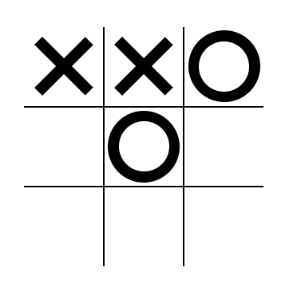

Here is the initial game state with hovering over a cell:

Now here is the game state when X is placed but we hover with O:

Now it is X's turn and they place it above the O's turn:

Next turn is O's turn and here it is placed:

Next turn is X's turn and they almost win:

This next picture shows O placing it in the bottom right corner and winning:

Here is a picture of the Restart button hovered:

